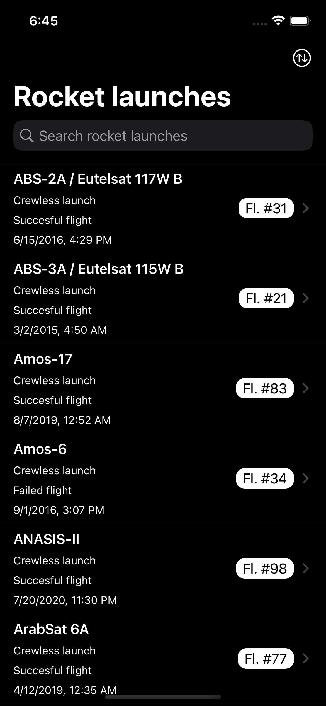
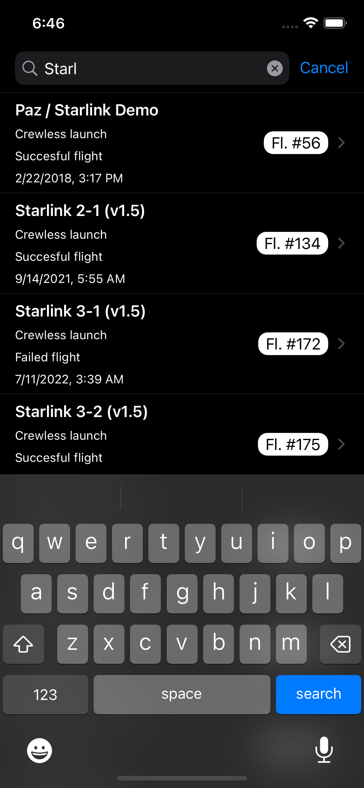
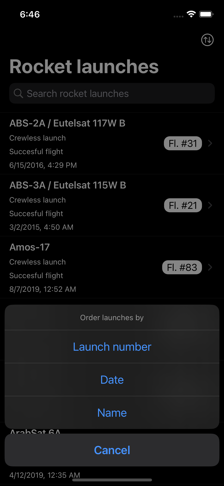
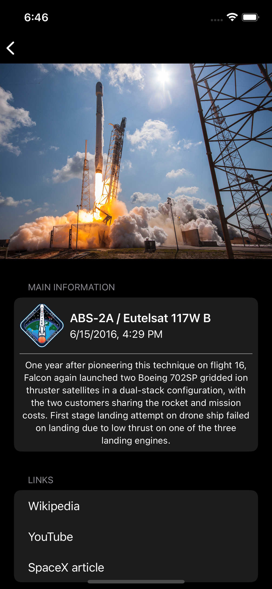
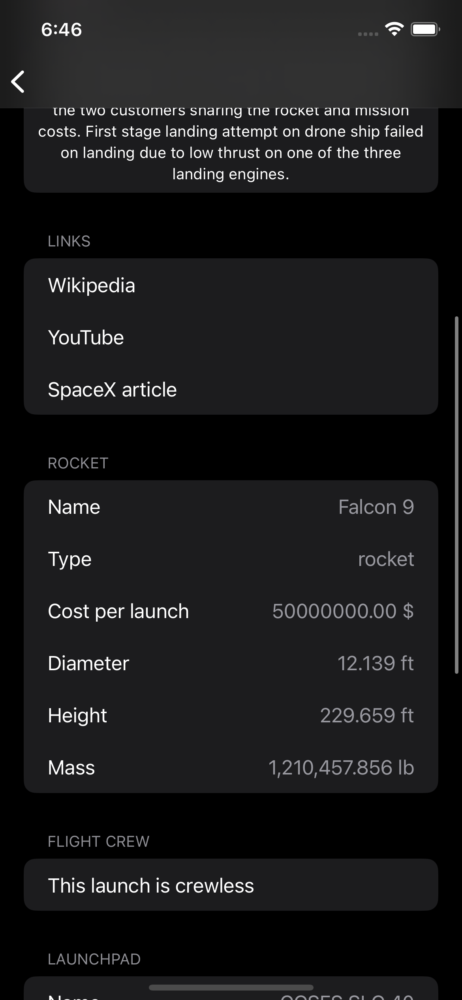
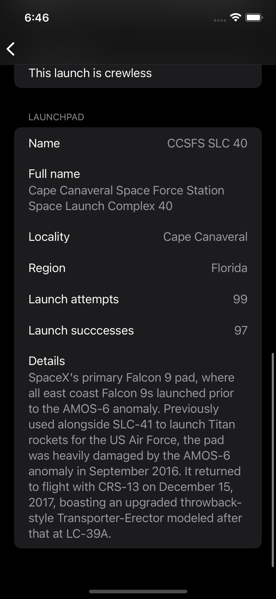
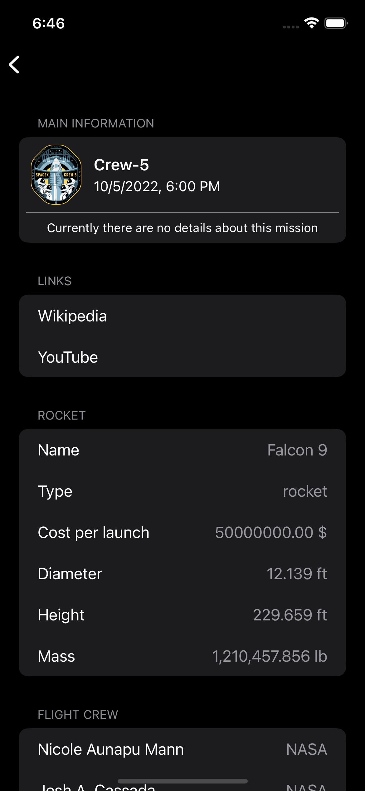

<!-- PROJECT LOGO -->
 

 

<h1 align="center">Elon's rockets</h1>

  

    Simple iOS app that presents all past Space-X launches
     

## About The Project

This project is my approach to Applifting's task for iOS developer hiring process. 

### Built With
[SpaceX-API](https://github.com/r-spacex/SpaceX-API)

### Prerequisites

* Xcode 14.0+

### Installation

1. Clone this repo to your computer or download project
2. Open Elon's Rockets.xcodeproj with Xcode 
3. Hit run

## Features

- [x] Show a list of launches
- [x] Show detail of one launch 
- [x] Order launches by name, date and launch number 
- [x] Search in launches by launch name
- [x] Dark/Light mode

### Launches list

### Launches detail

## Contributing

Contributions are what make the open source community such an amazing place to learn, inspire, and create. Any contributions you make are **greatly appreciated**.

If you have a suggestion that would make this better, please contact me on `stehlikadam@gmail.com`. You can also simply open an issue with the tag "enhancement".
Don't forget to give the project a star! Thanks again!

## Contact

Adam Stehlik - [Linked-In](https://www.linkedin.com/in/adam-stehlik/) - stehlikadam@gmail.com
